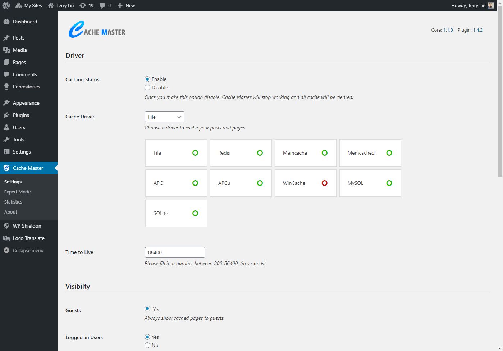
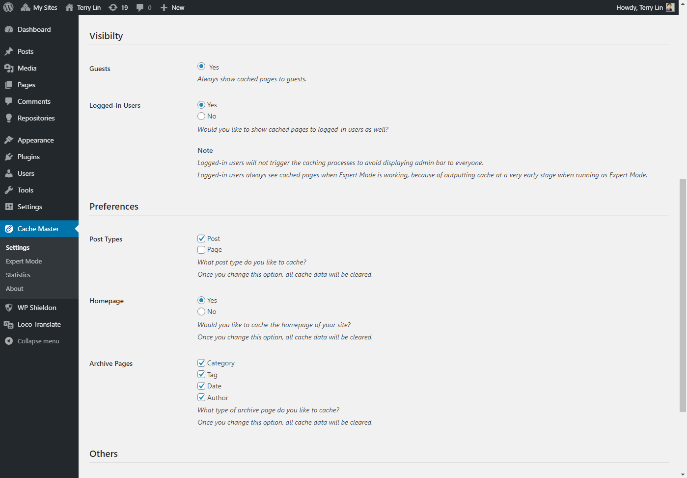
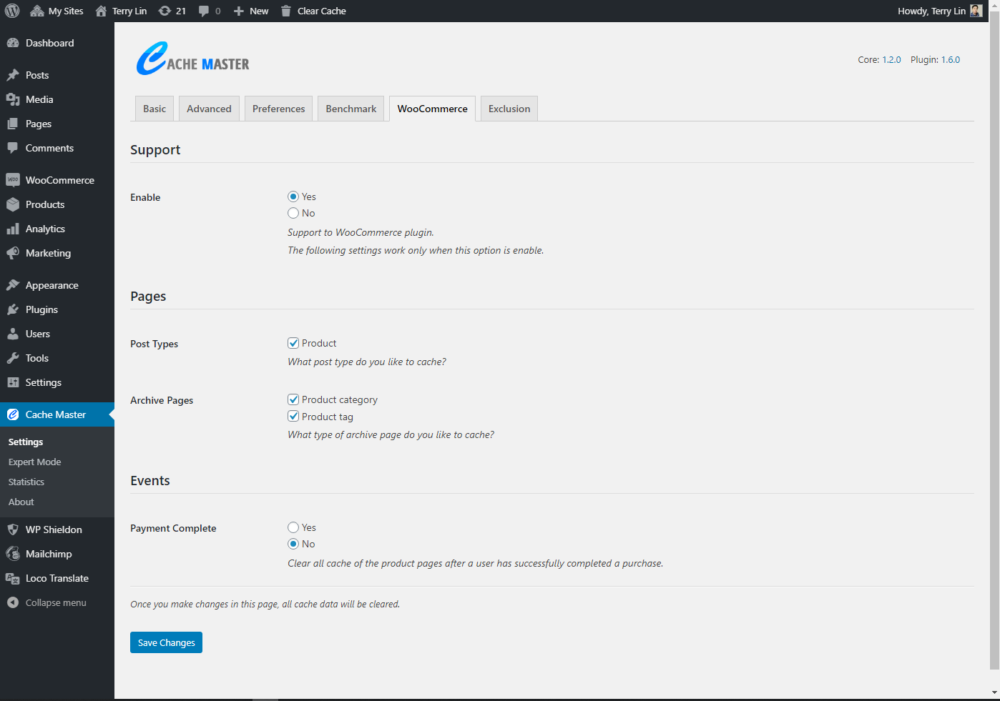
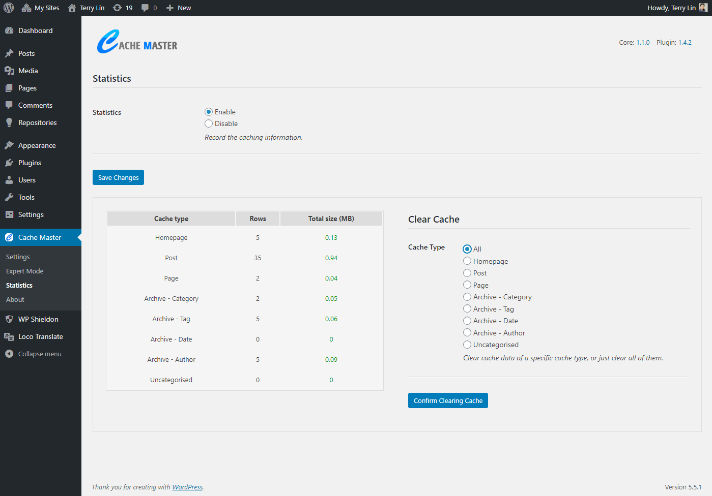
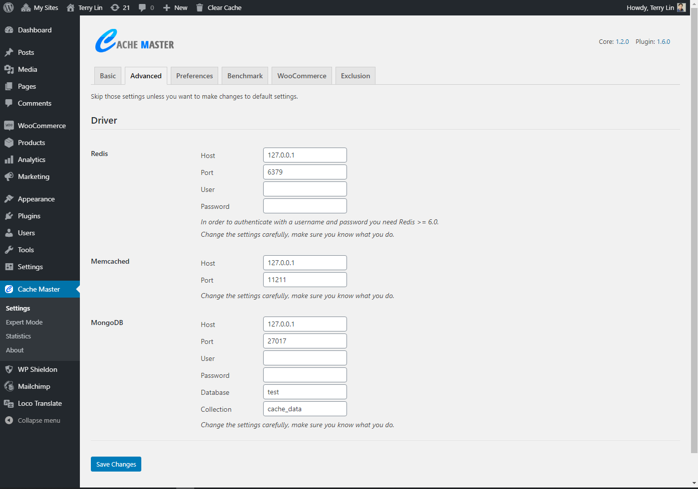
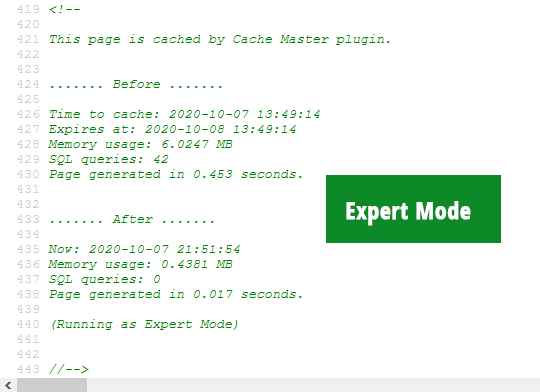

# Cache Master - WordPress Cache Plugin

Cache Master is an extremely light-weight and high-performace cache plugin that speeds up your WordPress sites on the fly. The core is driven by Shieldon [Simple Cache](https://github.com/terrylinooo/simple-cache), a PSR-16 simple cache library.

## Requirement

* PHP version > 7.1.0
* WordPress version > 4.7
* Tested up to 5.5.1

## Features

* Extremely light-weight and high-performace.
* Support up to 8 cache drivers such as Redis, Memcache, Memcached, APC, APCu, WinCache, MySQL and SQLite.
* Detailed cache statistics, easy to manage.

## Download

| source | download | 
| --- | --- | 
| WordPress | https://wordpress.org/plugins/cache-master/ |
| GitHub repository | https://github.com/terrylinooo/cache-master/releases | 
| PHP Composer | `composer create-project terrylinooo/cache-master cache-master` |

## Screenshots

Main setting page.

Main setting page (bottom)

Expert Mode setting page.

Cache statistics setting page.

#### Debug message

A debug message will be attached to the end of the page source code. `<!-- This page is cached by Cache Master plugin. //-->`. This is for debugging purpose only, to let us know that the page is caching.

(1)

Normal mode.

(2)

Expert mode.

### Notice

If you find your website doesn't work with Cache Master, please report an issue on GitHub and list all plugins installed on your website. I'll find out the problem and fix it.

### License

Cache Master is developed by [Terry Lin](https://terryl.in) and released under the terms of the GNU General Public License v3.

