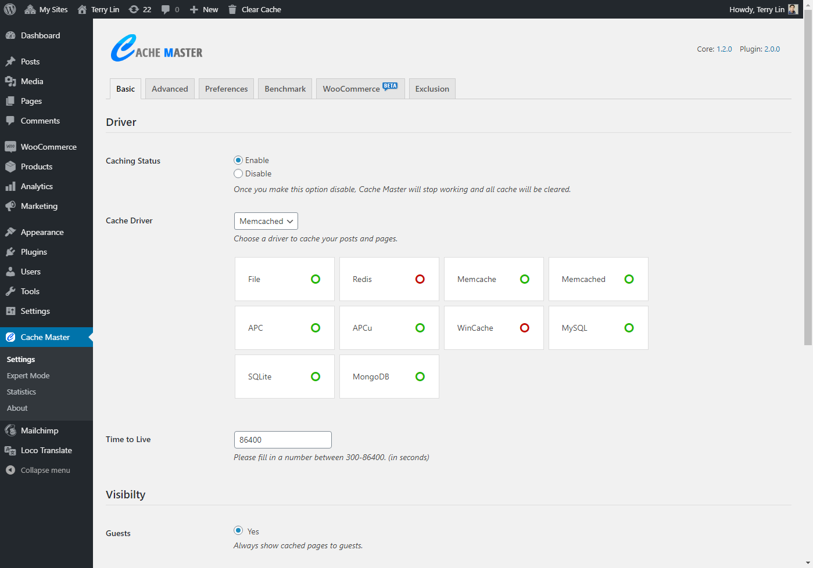
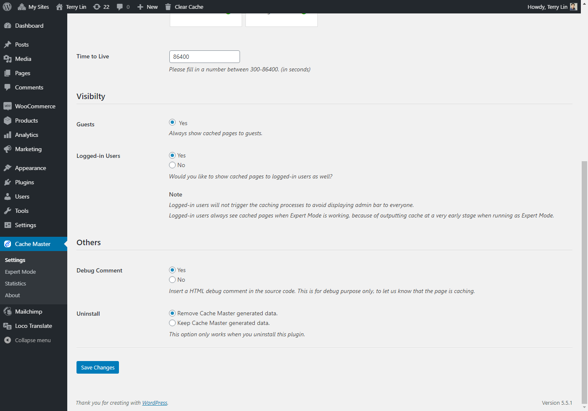
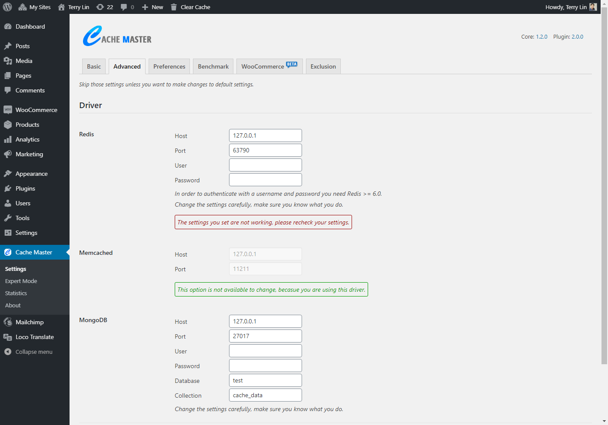
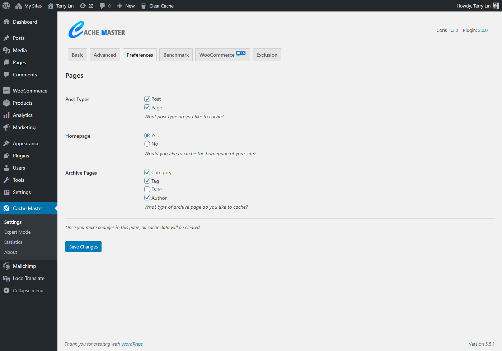
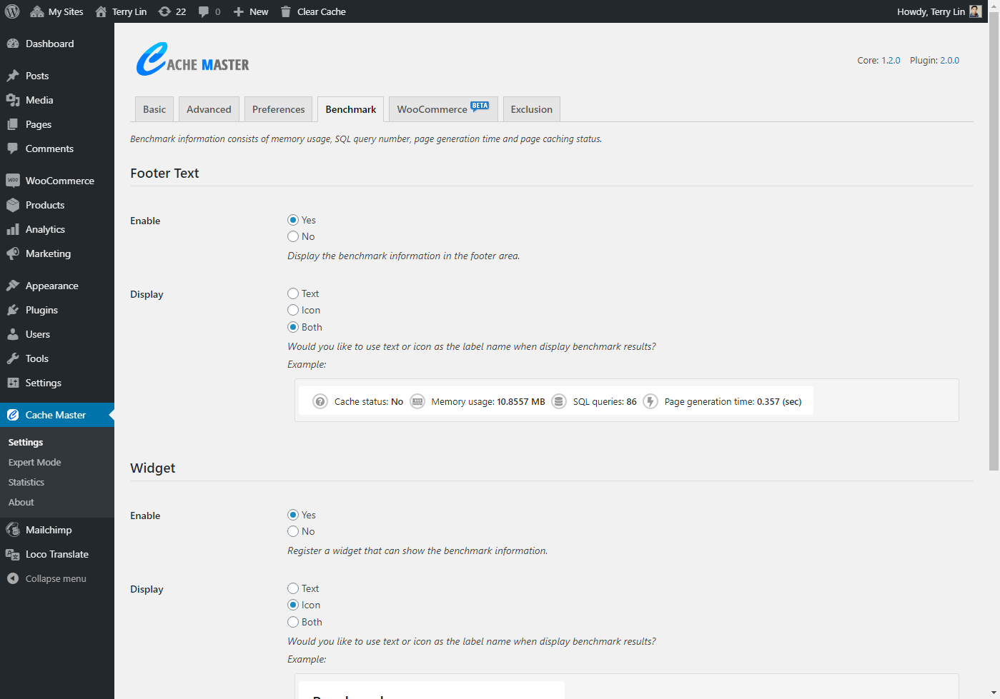
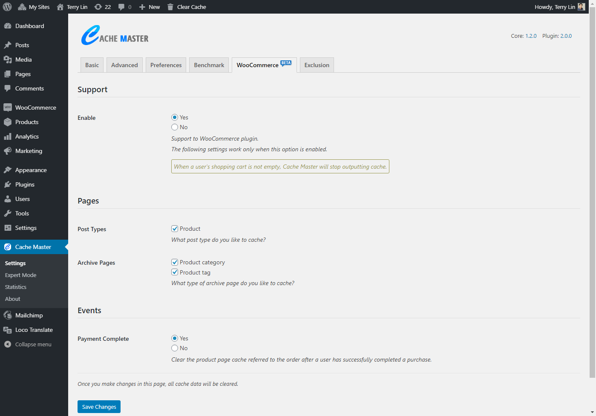
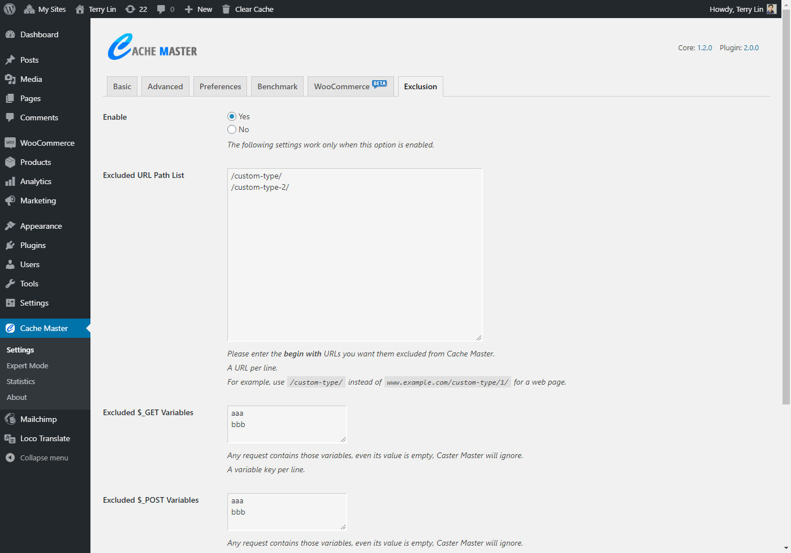
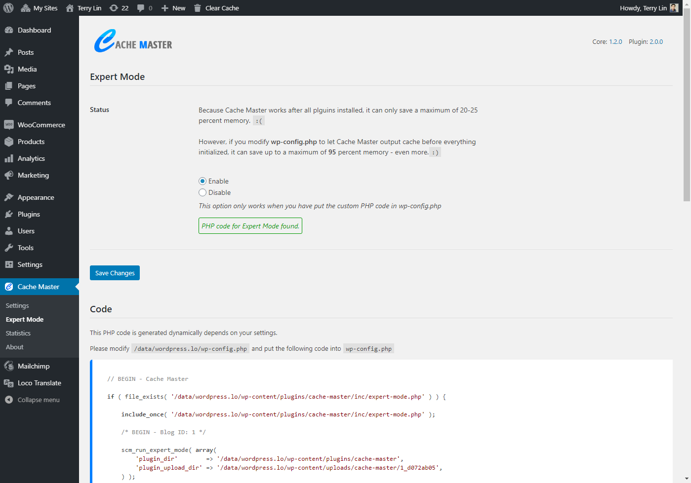
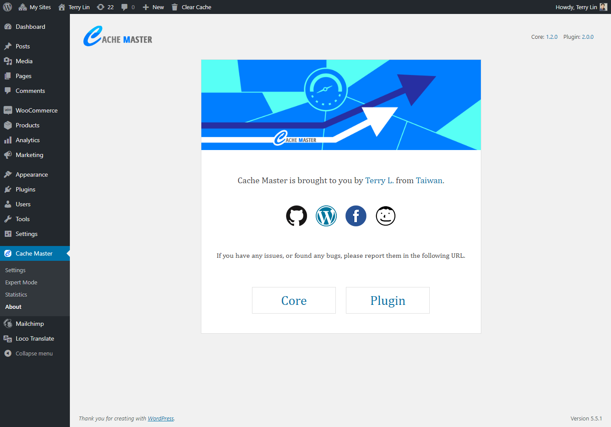
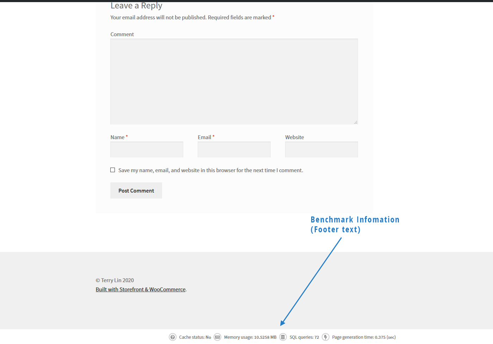

# Cache Master - WordPress Cache Plugin

 

Cache Master is an extremely lightweight, high-performance cache plugin that speeds up your WordPress sites on the fly. The core of Cache Master is driven by Shieldon [Simple Cache](https://github.com/terrylinooo/simple-cache), a PSR-16 simple cache library.

## Requirement

* PHP version > 7.1.0
* WordPress version > 4.7
* Tested up to WordPress 6.2.2
* Tested up to PHP 8.2.5

## Features

* Extremely lightweight and high-performance.
* Support up to 10 cache drivers such as File, Redis, Memcache, Memcached, APC, APCu, WinCache, MySQL, SQLite, and MongoDB.
* Provide detailed cache statistics, easy to manage.
* Compatible with the WooCommerce plugin.
* And more...

## Download

| source | download | 
| --- | --- | 
| WordPress | https://wordpress.org/plugins/cache-master/ |
| GitHub repository | https://github.com/terrylinooo/cache-master/releases | 
| PHP Composer | `composer create-project terrylinooo/cache-master cache-master` |

## Screenshots

Setting page - Basic.

Setting page - Basic (Bottom).

Setting page - Advanced.

Setting page - Perferences.

Setting page - Benchmark.

Setting page - WooCommerce.

Setting page - Exclusion.

Setting page - Expert mode.

Setting page - Cache statistics.

Setting page - About author.

Front page - Benchmark (footer text)

#### Translation

- Japanese (ja_JP) by [Colocal](https://colocal.com).

#### Debug message

A debug message will be appended to the end of the page's source code: `<!-- This page is cached by the Cache Master plugin. //-->`. This is intended for debugging purposes only, confirming that the page is being cached. This message can be disabled in the Settings page.

(1)

Normal mode.

(2)

Expert mode.

### Notice

If you encounter issues with your website when using Cache Master, please report the problem on GitHub and list all plugins installed on your website. I'll investigate the problem and provide a fix.

### License

Cache Master is developed by [Terry Lin](https://terryl.in) and released under the terms of the GNU General Public License v3.
